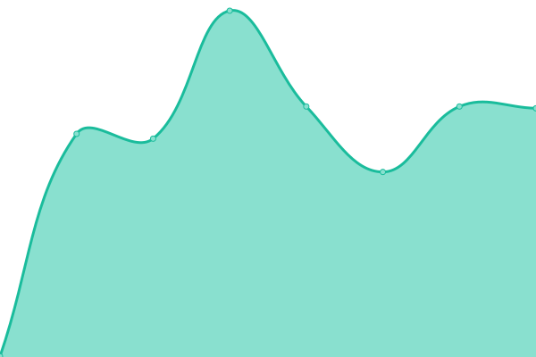

# [📈 Live Status](https://chimoney.github.io/chimoney-status): <!--live status--> **🟩 All systems operational**

This repository contains the open-source uptime monitor and status page for [Chimoney](http://chimoney.io/), powered by [Upptime](https://github.com/upptime/upptime).

With [Upptime](https://upptime.js.org), you can get your own unlimited and free uptime monitor and status page, powered entirely by a GitHub repository. We use [Issues](https://github.com/chimoney/chimoney-status/issues) as incident reports, [Actions](https://github.com/chimoney/chimoney-status/actions) as uptime monitors, and [Pages](https://chimoney.github.io/chimoney-status) for the status page.

<!--start: status pages-->
<!-- This summary is generated by Upptime (https://github.com/upptime/upptime) -->
<!-- Do not edit this manually, your changes will be overwritten -->
<!-- prettier-ignore -->
| URL | Status | History | Response Time | Uptime |
| --- | ------ | ------- | ------------- | ------ |
|  [Chimoney Infrastructure (API)](https://api.chimoney.io) | 🟩 Up | [chimoney-infrastructure-api.yml](https://github.com/Chimoney/chimoney-status/commits/HEAD/history/chimoney-infrastructure-api.yml) | 

 414ms
     
 | 

<a href="https://chimoney.github.io/chimoney-status/history/chimoney-infrastructure-api">100.00%</a>
    

|  [Chimoney Web Platform](https://dash.chimoney.io) | 🟩 Up | [chimoney-web-platform.yml](https://github.com/Chimoney/chimoney-status/commits/HEAD/history/chimoney-web-platform.yml) | 

 383ms
     
 | 

<a href="https://chimoney.github.io/chimoney-status/history/chimoney-web-platform">100.00%</a>
    

|  [Chimoney Website](https://chimoney.io) | 🟩 Up | [chimoney-website.yml](https://github.com/Chimoney/chimoney-status/commits/HEAD/history/chimoney-website.yml) | 

 923ms
     
 | 

<a href="https://chimoney.github.io/chimoney-status/history/chimoney-website">100.00%</a>
    

|  [Unispend](https://unispend.com) | 🟩 Up | [unispend.yml](https://github.com/Chimoney/chimoney-status/commits/HEAD/history/unispend.yml) | 

 253ms
     
 | 

<a href="https://chimoney.github.io/chimoney-status/history/unispend">100.00%</a>
    

|  [Chimoney App Website](https://chimoney.app) | 🟩 Up | [chimoney-app-website.yml](https://github.com/Chimoney/chimoney-status/commits/HEAD/history/chimoney-app-website.yml) | 

 454ms
     
 | 

<a href="https://chimoney.github.io/chimoney-status/history/chimoney-app-website">100.00%</a>
    

<!--end: status pages-->

[**Visit our status website →**](https://chimoney.github.io/chimoney-status)

## 📄 License

- Powered by: [Upptime](https://github.com/upptime/upptime)
- Code: [MIT](./LICENSE) © [Anand Chowdhary](https://anandchowdhary.com), supported by [Pabio](https://pabio.com)
- Data in the `./history` directory: [Open Database License](https://opendatacommons.org/licenses/odbl/1-0/)
